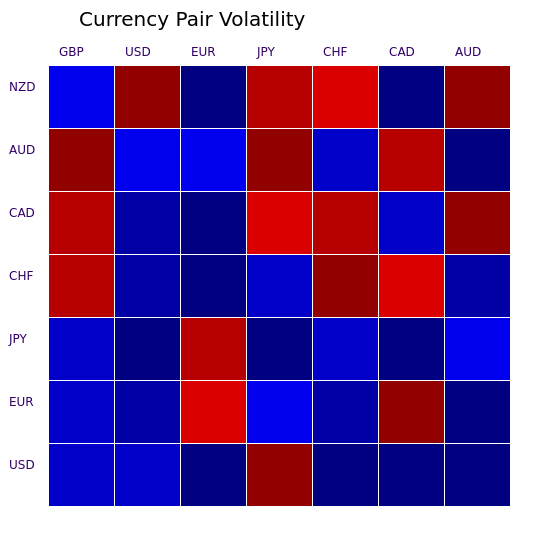

# Introduction
*kof* is a bridge between [Openfin](http://openfin.co/) and kdb+ using pubsub.  It includes an HTML5 heat map widget running in Openfin.

## Requirements
 - kdb+ v3.3 or later (for .z.wo)
 - Node npm (to install openfin)

## Source
 - A bridge between Openfin and kdb+  ([kof.js](kof.js))
   - uses a Websocket to kdb+
   - finds subscriptions provided by kdb+, publishes those names to the Openfin [IAB](http://cdn.openfin.co/jsdocs/stable/fin.desktop.InterApplicationBus.html) (topic "k")
   - listens for Openfin IAB subs and forwards these to kdb over a Websocket
   - listens for kdb+ pubs and publishes to the Openfin IAB
   - [option] kdb+ requests sub on IAB and [kof.js](kof.js) sends any matching pubs
 - HTML5 canvas heat map demo on Openfin with kdb+  ([index.htm](index.htm), [kof.js](kof.js), [app.json](app.json), [hm.htm](hm.htm), [hm.js](hm.js), [hm.q](hm.q))
   - an Openfin headless [app](app.json) that loads [index.htm](index.htm).
   - [index.htm](index.htm) creates an Openfin window for [hm.htm](hm.htm) 
   - hosted locally using kdb+ server for http and Websocket
   - [index.htm](index.htm) uses [kof.js](kof.js) to interface Openfin [IAB](http://cdn.openfin.co/jsdocs/stable/fin.desktop.InterApplicationBus.html)

## Background

 [openfin/app-bootstrap](https://github.com/openfin/app-bootstrap)

# Gettting Started
Kx libraries required:
 - [c.js](https://raw.githubusercontent.com/KxSystems/kdb/master/c/c.js)
 - [u.q](https://raw.githubusercontent.com/KxSystems/kdb-tick/master/tick/u.q)

on unix, use the [get](get) script:
```
$ . get 
 ```


Install Openfin if not installed
```
$ npm install -g openfin-cli 
 ```


Run q on port 5000 with [hm.q](hm.q).
  - Openfin needs the kdb+ http httpserver to deliver [index.htm](index.htm)
  - Openfin apps (in this case, the heat map demo) need the kdb+ Websocket server.

The one second timer (`-t 1000`) is for pubsub
```
$ q hm.q -p 5000 -t 1000 
 ```


Run Openfin with [app.json](app.json) 
```
$ openfin -l -c app.json 
 ```


*NB still random and contradictory*

